 

<h1 align="center">
  Hey! I'm CJ
</h1>
 

<b><a href="mailto:cocathecafe@gmail.com">Email me</a></b>
•
<b><a href="https://www.alexcj96.com">My Website</a></b>
•
<b><a href="https://blog.alexcj96.com">My Blog</a></b>
•
<b><a href="https://etherscan.io/address/0x2f2d07d60ea7330DD2314f4413CCbB2dC25276EF">Sponsor</a></b>

<b>A human smart contract instance deployed on earth chain.</b>

My name is **CJ**, a developer who is interested and specialized in **Ethereum, Polkadot, Cosmos, Starknet, Zero-Knowledge, Privacing Computing and Cross Chain tech**.

I graduated from [SHU](https://www.shu.edu.cn/) and obtained my Master degree at [UTT](https://www.utt.fr/) with a major in **Network, System and Telecommunications**.

I'm **ranked #74** on [wakatime leaderboard](https://wakatime.com/leaders), you can find me by searching **Cheng JIANG**.

## Projects

- [✅ **Parallel** ](https://github.com/parallel-finance/parallel) : A decentralized lending & staking protocol built on top of the Polkadot ecosystem (Rust)
- [✅ **Para Space** ](https://github.com/para-space/paraspace-core) : P2Pool NFT Lending & Marketplace (Solidity)
- [✅ **Casbin RS** ](https://github.com/casbin/casbin-rs) : An authorization library that supports access control models like ACL, RBAC, ABAC in Rust (Rust)
- [✅ **D3 Vs** ](https://github.com/gopherJ/Vs) : Vue Visualisation Package using d3.js and leaflet (VueJs, d3-js, Leaflet)
- [✅ **Diesel Adapter** ](https://github.com/casbin-rs/diesel-adapter) : Casbin adapter for mysql, postgres, sqlite based on Diesel (Rust)
- [✅ **Json Rules Engine** ](https://github.com/gopherJ/json-rules-engine-rs) : Full-featured json rules engine in Rust (Rust)
- [✅ **Actix Elastic** ](https://github.com/gopherJ/actix-elastic) : An actix actor for elasticsearch v7 (Rust)

